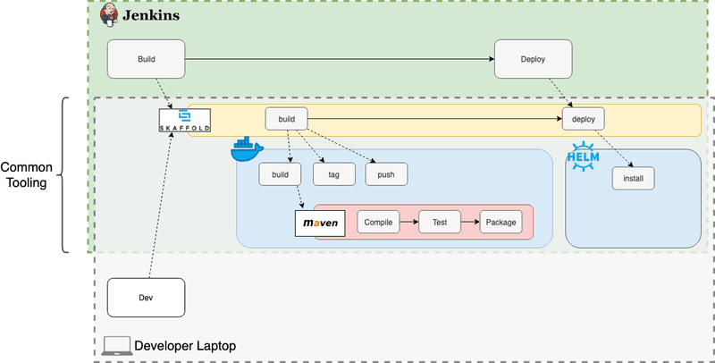

# Demo SpringBoot with Spring Cloud Kubernetes - Helm - Jenkins pipelines - Skaffold - Jib

## install HELM

* goto [Play with kubernetes](https://labs.play-with-k8s.com/)
* or goto [The katacoda k8s playground](https://www.katacoda.com/courses/kubernetes/launch-single-node-cluster)
* or goto [Kubernetes interactive cluster](https://kubernetes.io/docs/tutorials/kubernetes-basics/create-cluster/cluster-interactive/)
* git clone https://github.com/agilesolutions/springboot-helm-kubernetes.git
* cd springboot-helm-kubernetes/scripts
* chmod 777 *
* run scripts/install-helm.sh
* wait till tiller is up and running -> kubectl get pods -w -n kube-system
* run scripts/install-jenkins.sh
* kubectl get svc jenkins -n jenkins
* use port in katacoda to setup dashboard

## Installing jenkins from HELM

```
helm install stable/jenkins \
    --name jenkins \
    --namespace jenkins \
    --values helm/jenkins-values.yml
```

## After install jenkins follow up these steps....

1. Get your 'admin' user password by running:
  printf $(kubectl get secret --namespace jenkins jenkins -o jsonpath="{.data.jenkins-admin-password}" | base64 --decode);echo
2. Get the Jenkins URL to visit by running these commands in the same shell:
  NOTE: It may take a few minutes for the LoadBalancer IP to be available.
        You can watch the status of by running 'kubectl get svc --namespace jenkins -w jenkins'
  export SERVICE_IP=$(kubectl get svc --namespace jenkins jenkins --template "{{ range (index .status.loadBalancer.ingress 0) }}{{ . }}{{ end }}")
  echo http://$SERVICE_IP:8080/login
3. Login with the password from step 1 and the username: admin
4. [Configure kubernetes](https://www.blazemeter.com/blog/how-to-setup-scalable-jenkins-on-top-of-a-kubernetes-cluster/)
5. [Set Up a Jenkins CI/CD Pipeline with Kubernetes](https://akomljen.com/set-up-a-jenkins-ci-cd-pipeline-with-kubernetes/)
6. [about jnlp container](https://www.twistlock.com/2018/07/24/jenkins-pipeline-kubernetes-building-containers-integrating-security/)


Simple steps are taken on scripts/jenkins-verify.sh.

## some tests

* kubectl -n jenkins rollout status deployment jenkins 
* helm get values jenkins
* helm inspect values stable/jenkins
* kubectl describe svc jenkins
* kubectl port-forward -n jenkins jenkins-xxxx 8080:8080
* [connecting to jenkins service](https://kubernetes.io/docs/concepts/services-networking/connect-applications-service/)

Jib builds optimized Docker and [OCI](https://github.com/opencontainers/image-spec) images for your Java applications without a Docker daemon - and without deep mastery of Docker best-practices. It is available as plugins for [Maven](jib-maven-plugin) and as a Java library.

[Maven](https://maven.apache.org/): See documentation for [jib-maven-plugin](jib-maven-plugin).\

## Goals

* **Fast** - Deploy your changes fast. Jib separates your application into multiple layers, splitting dependencies from classes. Now you don’t have to wait for Docker to rebuild your entire Java application - just deploy the layers that changed.

* **Reproducible** - Rebuilding your container image with the same contents always generates the same image. Never trigger an unnecessary update again.

* **Daemonless** - Reduce your CLI dependencies. Build your Docker image from within Maven or Gradle and push to any registry of your choice. *No more writing Dockerfiles and calling docker build/push.*


## How to use?

This archetype is not published to NEXUS. 
You can generate project using this archetype using `mvn archetype:generate` and select the archetype number.

### Generate application from archetype

```
mvn archetype:generate \
    -B -DarchetypeGroupId=com.agilesolutions.springboot \
    -DarchetypeArtifactId=spring-boot-k8s-archetype \
    -DarchetypeVersion=0.0.1 \
    -DgroupId=com.mycompany \
    -DartifactId=myapp \
    -Dversion=1.0-SNAPSHOT \
    -Dpackage=com.mycompany.myapp
```


Generates basic SpringBoot REST API application with the following features:

* Skaffold build
* Monitoring with Prometheus, Grafana
* ELK based logging

## Building with Skaffold and Jib

* skaffold dev
* mvn compile jib:build
* mvn compile jib:buildTar



## Developer Notes

Copy skaffold and kubectl binaries from W:\k8s, put bot exe's on your windows PATH variable

### Configure access to dev cluster

```
kubectl config --kubeconfig=./config/development.conf use-context development
```

## Global Pipeline Libraries

---

```bash
open "http://$JENKINS_ADDR/configure"
```

* Click the *Add* button in *Global Pipeline Libraries*
* Type *my-library* as the *Name*
* Type *master* as the *Default version*
* Click the *Load implicitly* checkbox
* Select *Modern SCM* from the *Retrieval method* section
* Select *Git* from *Source Code Management*
* Copy [jenkins-shared-libraries.git](https://bitbucket.agilesolutions.com/scm/res/jenkins-shared-libraries.git), return to Jenkins UI, and paste it into the *Project Repository* field
* Click the *Save* button to persist the changes


## docus

* [Faster Feedback for Delivery Pipelines with Skaffold](https://www.liatrio.com/blog/delivery-pipelines-with-skaffold)
* [Introducing Jib — build Java Docker images better ](https://cloudplatform.googleblog.com/2018/07/introducing-jib-build-java-docker-images-better.html)
* [Jib github](https://github.com/GoogleContainerTools/jib)
* [Distroless Docker images](https://github.com/GoogleContainerTools/distroless)
* [Configuration Management in SpringBoot Cloud with Kubernetes ConfigMap](https://medium.com/codeops/configuration-management-in-springboot-cloud-with-kubernetes-configmap-b1f180fbdfec)
* [ConfigMap – Kubernetes Example with YAML](https://matthewpalmer.net/kubernetes-app-developer/articles/configmap-example-yaml.html)
