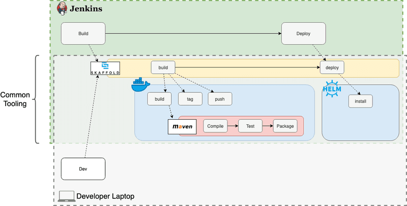

# Spring Boot with Skaffold, Helm and Kubernetes enabled Jenkins
Provides a ready to run CI/CD/CDP environment on k8s with the following components.

1. Demo SpringBoot app to proof all the CI/CD stuff provided further on
2. HELM charts to boot up Jenkins and ChartMuseam from [github helm charts stable](https://github.com/helm/charts/tree/master/stable)
3. Overriding Jenkins k8s configmap with custom configurations, like JIRA integration, shareable libraries for pipelines and more in [jenkins-config.tpl](./jenkins/templates/jenkins-config.tpl)
4. Config map under 3 is overwriting the default provided Jenkins config.xml at [config.yaml](https://github.com/helm/charts/blob/master/stable/jenkins/templates/config.yaml), check the expression "{{- if not .Values.master.customConfigMap }}" at the top
5. CI and CD pipelines utilizing the [Jenkins Kubernetes plugin](https://hub.kubeapps.com/charts/stable/jenkins) and [JIRA integration plugin](https://jenkinsci.github.io/jira-steps-plugin/) located on this project under [pipelines](./pipelines)
6. Three Jenkins Release and Deployment jobs are provided on [values.yaml](./jenkins/values.yaml)
6. Kubernetes cloud and POD setup for running k8s multistage pipelines at [KubernetesPod.yaml](./pipelines/KubernetesPod.yaml)
7. Global Jenkins pipeline library supporting all pipelines mentioned at 5 which you can find at [vars](./vars)

## Documententation introducing Jenkins on k8s cluster

* Read the [Jenkins HELM chart instructions](https://github.com/helm/charts/tree/master/stable/jenkins) how I customized the Jenkins setups.
* Read the [HELM template guide](https://helm.sh/docs/chart_template_guide/) to understand the jenkins template I provided at 3.

## What is more on this demo project

1. Running skaffold to support developers speeding up with testing
2. How you can do a structure test the images you build with skaffold
3. Building your app with the MAVEN [JIB](https://github.com/GoogleContainerTools/jib) plugin
4. Some configs to integrate your app with logstash, prometheus and micrometer as [config](./config)

## Faster delivering to kubernetes from your local developer workspace
In order for the developer to test changes to the Jenkins pipeline, the developer must create a new commit and push the commit to their source code management system to execute the test. Skaffold helps developers to run
CI/CD pipelines on the developer's laptop that will run maven builds, docker builds and deploying to k8s clusters through manifests or Helm. Read [Faster Feedback for Delivery Pipelines with Skaffold](https://www.liatrio.com/blog/delivery-pipelines-with-skaffold)



Simply run this command to continuously watch over your workspace changes and automatically tiggering building, packaging and deploying your app on k8s cluster.

```
skaffold dev
```

## [JIB](https://github.com/GoogleContainerTools/jib) Maven build Docker images without having Docker Daemon installed...

Jib builds optimized Docker and [OCI](https://github.com/opencontainers/image-spec) images for your Java applications without a Docker daemon - and without deep mastery of Docker best-practices. It is available as plugins for [Maven](https://github.com/GoogleContainerTools/jib/tree/master/jib-maven-plugin) and as a Java library.

[Maven](https://maven.apache.org/): See documentation for [jib-maven-plugin](https://github.com/GoogleContainerTools/jib/tree/master/jib-maven-plugin).

### The benefits are

* **Fast** - Deploy your changes fast. Jib separates your application into multiple layers, splitting dependencies from classes. Now you don’t have to wait for Docker to rebuild your entire Java application - just deploy the layers that changed.

* **Reproducible** - Rebuilding your container image with the same contents always generates the same image. Never trigger an unnecessary update again.

* **Daemonless** - Reduce your CLI dependencies. Build your Docker image from within Maven or Gradle and push to any registry of your choice. *No more writing Dockerfiles and calling docker build/push.*

Simply run ....

```
mvn compile jib:build
```


# About demo app and nginx Inress and certificate management (to be followed up)
If you need to use HTTP/2 features for your application, you have to pass through the HTTPS connection directly to your backend, even if the proxy used HTTPS internally then you still wouldn't have an end-to-end encryption. For these cases the Ingress controller has an option to enable SSL/TLS pass through. At first you have to install the Ingress controller with a specific parameter, to make SSL/TLS pass through available as a feature (if an Ingress controller is already installed, you have to remove it first)

1. [cert-manager is a Kubernetes addon to automate the management and issuance of TLS certificates from various issuing sources](https://github.com/jetstack/cert-manager/tree/master/deploy/charts/cert-manager)
2. [Using Ingress with SSL/TLS termination and HTTP/2](https://www.thenativeweb.io/blog/2018-07-03-16-17-kubernetes-using-ingress-with-ssl-tls-termination-and-http2/#passing-through-https-and-http%2F2-with-ingress)
3. [NGINX Ingress Controller](https://kubernetes.github.io/ingress-nginx/user-guide/tls/)


## Developer Notes

Copy skaffold and kubectl binaries from W:\k8s, put both exe's on your windows PATH variable

### Configure access to dev cluster

```
kubectl config --kubeconfig=./config/development.conf use-context development

```

## install HELM

* goto [Play with kubernetes](https://labs.play-with-k8s.com/)
* or goto [The katacoda k8s playground](https://www.katacoda.com/courses/kubernetes/launch-single-node-cluster)
* or goto [Kubernetes interactive cluster](https://kubernetes.io/docs/tutorials/kubernetes-basics/create-cluster/cluster-interactive/)
* git clone https://github.com/agilesolutions/springboot-helm-kubernetes.git
* cd springboot-helm-kubernetes/scripts
* chmod 777 *
* run scripts/install-helm.sh
* wait till tiller is up and running -> kubectl get pods -w -n kube-system
* run scripts/install-jenkins.sh
* kubectl get svc jenkins -n jenkins
* use port in katacoda to setup dashboard

## Installing jenkins from HELM

```
helm install stable/jenkins \
    --name jenkins \
    --namespace jenkins \
    --values helm/jenkins-values.yml
```

## After install jenkins follow up these steps....

1. Get your 'admin' user password by running:
  printf $(kubectl get secret --namespace jenkins jenkins -o jsonpath="{.data.jenkins-admin-password}" | base64 --decode);echo
2. Get the Jenkins URL to visit by running these commands in the same shell:
  NOTE: It may take a few minutes for the LoadBalancer IP to be available.
        You can watch the status of by running 'kubectl get svc --namespace jenkins -w jenkins'
  export SERVICE_IP=$(kubectl get svc --namespace jenkins jenkins --template "{{ range (index .status.loadBalancer.ingress 0) }}{{ . }}{{ end }}")
  echo http://$SERVICE_IP:8080/login
3. Login with the password from step 1 and the username: admin
4. [Configure kubernetes](https://www.blazemeter.com/blog/how-to-setup-scalable-jenkins-on-top-of-a-kubernetes-cluster/)
5. [Set Up a Jenkins CI/CD Pipeline with Kubernetes](https://akomljen.com/set-up-a-jenkins-ci-cd-pipeline-with-kubernetes/)
6. [about jnlp container](https://www.twistlock.com/2018/07/24/jenkins-pipeline-kubernetes-building-containers-integrating-security/)


Simple steps are taken on scripts/jenkins-verify.sh.

## some tests

* kubectl -n jenkins rollout status deployment jenkins 
* helm get values jenkins
* helm inspect values stable/jenkins
* kubectl describe svc jenkins
* kubectl port-forward -n jenkins jenkins-xxxx 8080:8080
* [connecting to jenkins service](https://kubernetes.io/docs/concepts/services-networking/connect-applications-service/)


## docus

* [Faster Feedback for Delivery Pipelines with Skaffold](https://www.liatrio.com/blog/delivery-pipelines-with-skaffold)
* [Introducing Jib — build Java Docker images better ](https://cloudplatform.googleblog.com/2018/07/introducing-jib-build-java-docker-images-better.html)
* [Jib github](https://github.com/GoogleContainerTools/jib)
* [Distroless Docker images](https://github.com/GoogleContainerTools/distroless)
* [Configuration Management in SpringBoot Cloud with Kubernetes ConfigMap](https://medium.com/codeops/configuration-management-in-springboot-cloud-with-kubernetes-configmap-b1f180fbdfec)
* [ConfigMap – Kubernetes Example with YAML](https://matthewpalmer.net/kubernetes-app-developer/articles/configmap-example-yaml.html)
* [Set Up a Jenkins CI/CD Pipeline with Kubernetes](https://akomljen.com/set-up-a-jenkins-ci-cd-pipeline-with-kubernetes/)
